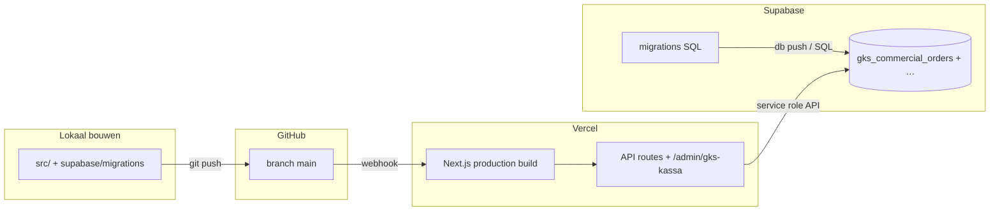

# Deployment-map — GKS / gks-kassa

Alles wat we voor GKS in **de cloud** bouwen loopt via **één** GitHub-repo → **één** Vercel-build (alle tenants) → **één** Supabase-project. Geen aparte deploy per klant.



---

## 1. GitHub — wat commit & push

Alleen paden onder de website-repo. **Niet** committen: `apps/vysion-print-agent/**` (lokaal per zaak, projectregel).

### GKS-kassa (live na Vercel-deploy)

| Pad | Rol |
|-----|-----|
| `src/app/shop/[tenant]/admin/gks-kassa/layout.tsx` | Route-layout GKS-POS |
| `src/app/shop/[tenant]/admin/gks-kassa/page.tsx` | GKS-kassa UI (fork, geïsoleerd) |
| `src/app/api/gks-kassa/commercial-orders/route.ts` | Server: CRUD `gks_commercial_orders` |
| `src/lib/gks-kassa/*` | Client-isolatie, offline, API-client, keys |
| `src/lib/use-gks-kassa-offline-flush-bridge.ts` | Offline flush (GKS queue) |

### Supabase (schema — moet óók op DB draaien, zie §3)

| Pad | Rol |
|-----|-----|
| `supabase/migrations/20260606120000_gks_commercial_orders_isolated.sql` | Tabel `gks_commercial_orders` + RLS |

### Fiscale module (voorbereiding, nog geen volledige FDM-cert)

| Pad | Rol |
|-----|-----|
| `src/gks/README.md` | Architectuur FDM / journal / audit |
| `src/pos/README.md`, `src/pos/*` | POS-sale types (stubs) |
| `src/components/pos/` | UI-stubs indien aanwezig |

### Documentatie (geen runtime, wel in repo)

| Pad | Rol |
|-----|-----|
| `docs/gks/README.md` | Index |
| `docs/gks/DEPLOYMENT-MAP.md` | Dit bestand |
| `src/lib/gks-kassa/ISOLATION.md` | Productie-kassa vs GKS |

### Bewust buiten GitHub / Vercel

| Pad | Waarom |
|-----|--------|
| `apps/vysion-print-agent/**` | Electron lokaal; niet via Vercel |
| Checkbox FDM / BII op locatie | Hardware/partner; geen tenant-deploy |
| Browser `localStorage` / IndexedDB `vysion-gks-kassa-offline` | Per apparaat, niet in cloud |

### Productie-kassa — grens

| Pad | Regel |
|-----|--------|
| `src/app/shop/[tenant]/admin/kassa/**` | **Geen wijzigingen** voor GKS-werk |

---

## 2. Vercel — wat wordt gebouwd en live staat

- **Trigger:** push naar GitHub (`main` = production voor alle subdomeinen/tenants).
- **Preview:** PR- of branch-deploy = sandbox testen (zie `TESTRAPORT.md`).
- **Eén build** deelt alle tenants; geen per-klant build.

### URLs (per tenant)

| Wat | URL-patroon |
|-----|-------------|
| GKS-kassa (pilot) | `https://{tenant-domein}/shop/{tenant}/admin/gks-kassa` |
| Productie-kassa (ongewijzigd) | `https://…/shop/{tenant}/admin/kassa` |

### API op Vercel (serverless)

| Endpoint | Methode | Auth |
|----------|---------|------|
| `/api/gks-kassa/commercial-orders` | `POST` (op: select / insert / update / delete / order_number_by_uuid) | Zelfde tenant/superadmin-headers als `/api/kassa/sync-z-report` |

### Wat Vercel **niet** doet

- Geen Supabase-migraties automatisch (tenzij jullie aparte CI hebben) → migratie handmatig of pipeline op Supabase.
- Geen print agent installeren.

### Track A — preview (geen productie-kassa wijzigen)

| Stap | Actie |
|------|--------|
| Branch | `gks/fiscal-journal-preview` → Vercel **Preview** (niet `main` tenzij bewust) |
| Vercel env (preview) | `NEXT_PUBLIC_GKS_PILOT_TENANTS=gkstest` (komma-gescheiden bij meerdere) |
| Supabase | Migraties `*gks*` + `fiscal_journal` — zie `supabase/gks-pilot-A1-preview-verify.sql` |
| GKS-URL | `/shop/gkstest/gks` (legacy `/admin/gks-kassa` redirect) |
| Readiness API | `GET /api/gks-kassa/pilot-readiness?tenant_slug=gkstest` (ingelogd als zaak/superadmin) |
| Productie-check | `git diff -- 'src/app/shop/[tenant]/admin/kassa/'` moet **leeg** blijven |

### Na push — checklist

1. Vercel deployment **Ready** (preview branch).
2. Preview-URL → inloggen → `/shop/{pilot}/gks` (niet `/admin/kassa`).
3. Optioneel: `npx tsc --noEmit` vóór commit (TypeScript).

---

## 3. Supabase — schema & data

### Migratie (verplicht vóór GKS-orders werken)

**Bestand:** `supabase/migrations/20260606120000_gks_commercial_orders_isolated.sql`

**Objecten:**

- Tabel `public.gks_commercial_orders` (`tenant_slug`, `kassa_client_uuid`, `order_number`, status, items JSONB, …)
- Unique index `(tenant_slug, kassa_client_uuid)` waar uuid niet null
- RLS aan + policies (service role via API-route blijft leidend voor writes)

**Toepassen (kies wat jullie gebruiken):**

```bash
# CLI gekoppeld aan project
supabase db push

# of: SQL in Supabase Dashboard → SQL Editor (inhoud migratiebestand)
```

Zonder deze migratie: `/api/gks-kassa/commercial-orders` faalt (tabel ontbreekt).

### Data-scheiding

| Tabel | Wie schrijft (GKS-pilot) | Productie-kassa |
|-------|---------------------------|-----------------|
| `orders` | **Niet** via gks-kassa | Ja |
| `z_reports` | **Niet** via gks-kassa (Z-sync no-op) | Ja |
| `gks_commercial_orders` | Alleen gks-kassa API | Nee |

### Later (uit `src/gks/README.md`, nog te bouwen + migreren)

- Fiscaal journal / audit-tabellen
- `POST /api/gks/fiscal-ticket`, `GET /api/gks/audit-export` (routes bestaan nog niet in repo)

---

## 4. Volgorde: van lokaal naar alle tenants

| Stap | Actie | Waar |
|------|--------|------|
| 1 | Code klaar, `tsc` ok | Lokaal |
| 2 | `git add` alleen GKS + docs + migratie (**geen** print-agent) | Git |
| 3 | `git commit` + `git push origin main` (of PR → merge) | GitHub |
| 4 | Migratie draaien als stap 3 nog geen auto-migrate doet | Supabase |
| 5 | Wacht Vercel **Ready** | Vercel |
| 6 | Test preview/production URL `…/admin/gks-kassa` | Browser |
| 7 | Bevestig productie-kassa: geen diff in `admin/kassa/` | Git |

---

## 5. Snel zoeken in de repo

```bash
# Alles GKS-gerelateerd (indicatief)
rg -l 'gks-kassa|gks_commercial' src supabase docs

# Productie-kassa onaangetast?
git diff -- 'src/app/shop/[tenant]/admin/kassa/'
```

---

## 6. Samenvatting in één zin

**GitHub** bevat de Next.js-code + SQL-migraties; **Vercel** serveert UI en `/api/gks-kassa/*` voor alle tenants; **Supabase** krijgt de migratie voor `gks_commercial_orders` — productie-`orders` en `/admin/kassa` blijven buiten de GKS-schrijfpad.
